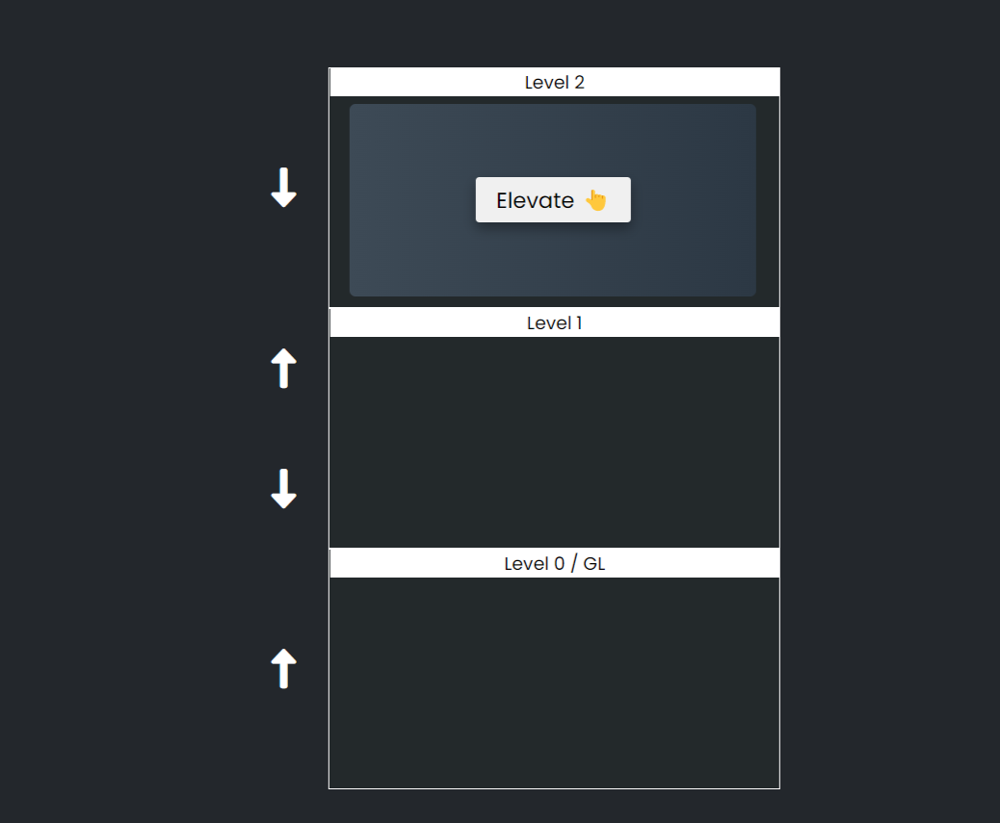

# Elevator Assignment 🛗

It is a Web application that facilitates the exchange of cryptocurrencies in an easy and interactive manner through the use of Giphy Api

## 🚀 Live Demo

- Click Here : [@Elevator Assignment](https://elevator-assignment.netlify.app/)

## 👀 Overview

## 🧑‍💻 Author

- [@Zeel Rabadiya](https://www.github.com/l33Z)

## ⚙️ Tech Stack

**Stack:** Html, Css, Javascript
